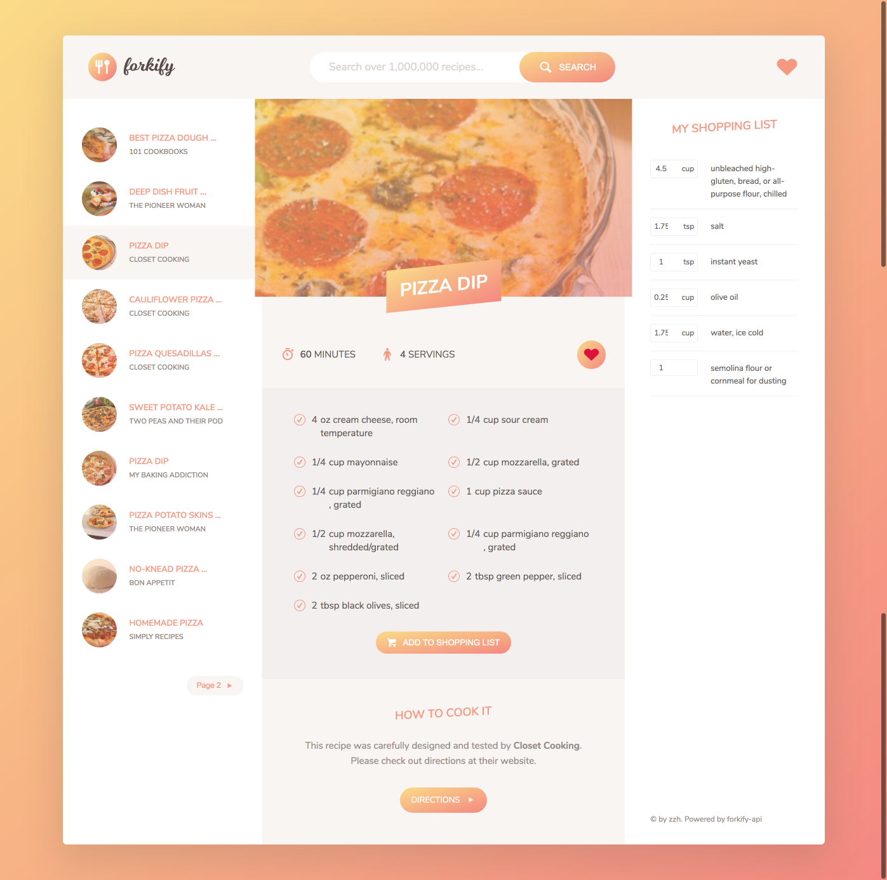
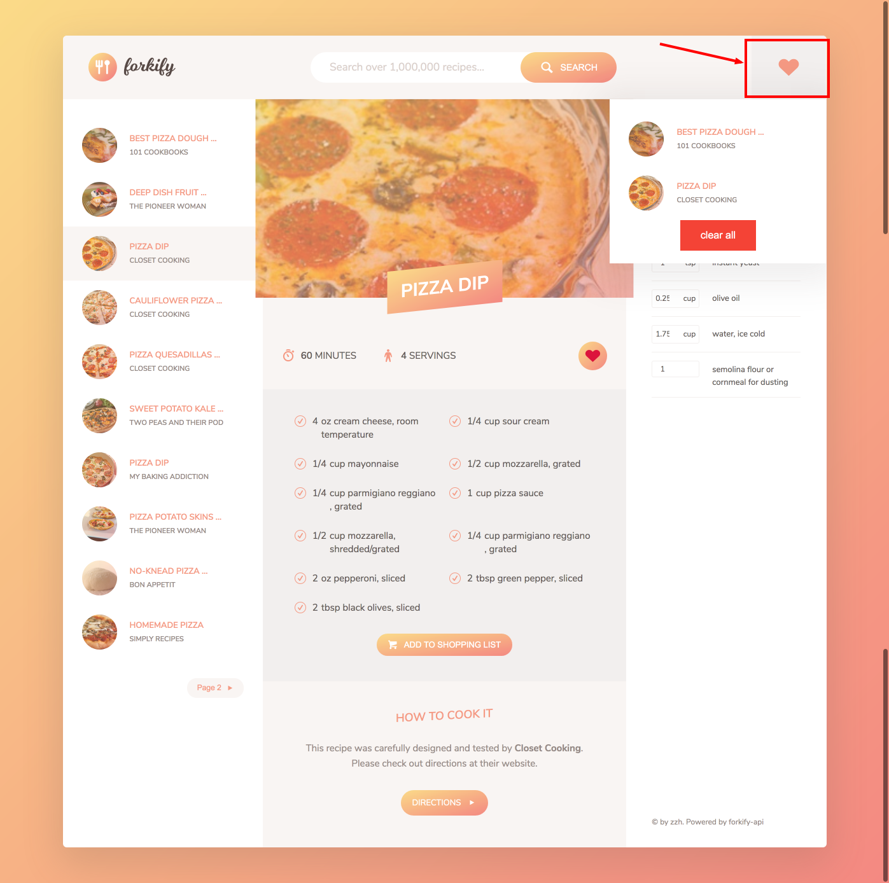

# forkify instruction

This is a simple project for practicing javascript.  
the project interacting with a real API to fetch and display some real food recipe data.  

**Important details:**  
* Search terms are **limited.** Search for "pizza" or another meal from this list 
* No need to use CORS proxy or API key
* Supports up to 100 requests per hour
* Only GET requests allowed

Available search queries:  
* pizza
* pasta
* carrot
* broccoli
* asparagus
* cauliflower
* corn
* cucumber
* green pepper
* lettuce
* mushrooms
* onion

more search query please see the following documentation:  
https://forkify-api.herokuapp.com/phrases.html

**Online demo:**  
http://forkify-javascript.s3-website-ap-southeast-2.amazonaws.com/  

Implementation:
* Project Architecture with MVC
* Rendering an AJAX Loading Spinner
* Search Results Pagination
* Building the Likes View
* Persistent Data with localStorage

The screenshot of project:

Forkify API documentation:  
http://forkify-api.herokuapp.com/

 
 
 

